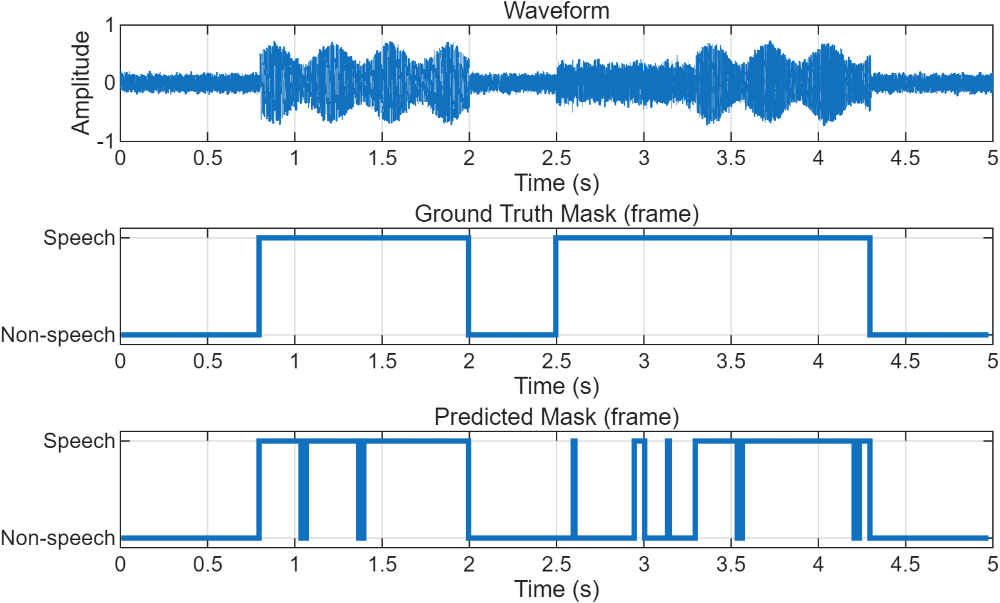
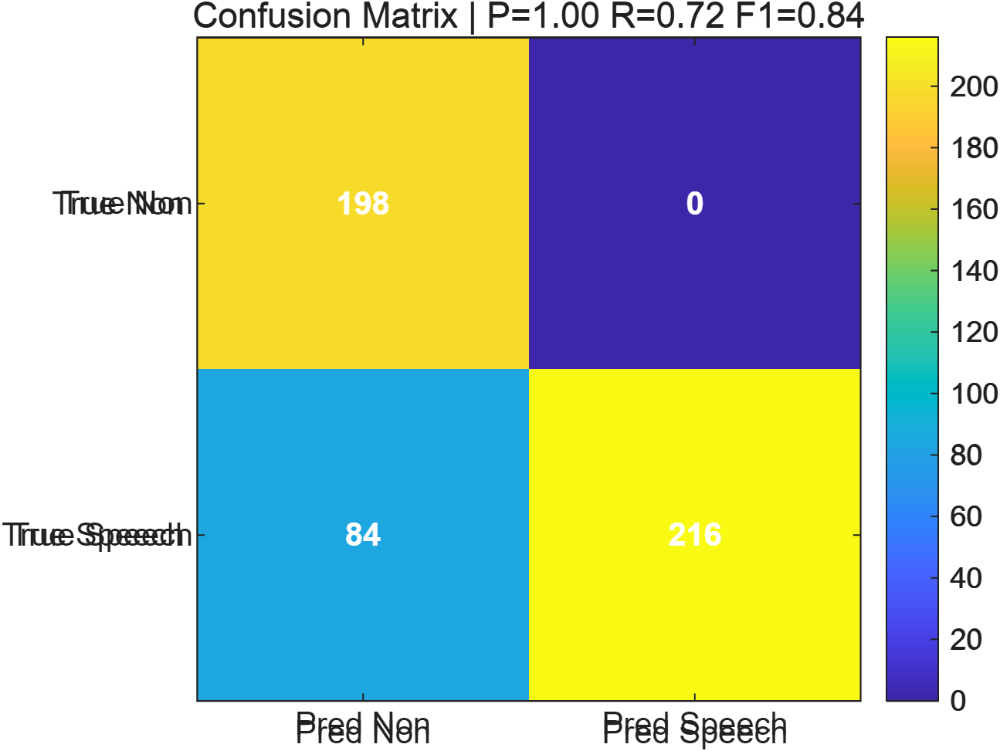
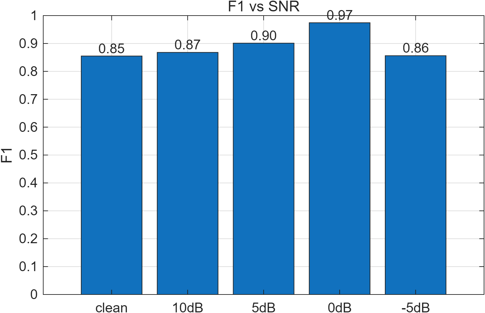

# Noise-Robust Voice Activity Detection (VAD)

Repo: https://github.com/guli0019/elec5305-project-540281325 
Student: Guanzhen Li (SID: 540281325) • Course: ELEC5305

## Snapshot
Minimal, reproducible VAD baseline (STE + ZCR, adaptive thresholds + smoothing).  
Planned as a **front-end** for pitch tracking / singing assessment.

## Current progress
- Features: STE & ZCR, 25 ms frame / 10 ms hop  
- Decision: energy `median(STE) + 0.35×MAD` + ZCR `0.60` quantile; **5-frame** smoothing  
- **Preliminary (10 dB)**: Precision ≈ **1.00**, Recall ≈ **0.72**, F1 ≈ **0.84**  
- F1 vs SNR (clean/10/5/0/−5 dB)

## Quickstart (MATLAB)
- Open `code/Report2_GuanzhenLi.mlx` and **Run All**  
  or run `code/report2_vad_minimal.m`  
- Figures -> `figures/`, metrics -> `results/`

## Results (preview)
 

## Next
- Add simple band-pass / spectral pre-processing; evaluate gains  
- Add hysteresis (double thresholds) to reduce chattering  
- Advice wanted: adaptive vs frozen thresholds across SNRs

## References 
1. Witt, S. M., & Young, S. J. (2000). Phone-level pronunciation scoring and assessment for interactive language learning. Speech communication, 30(2-3), 95-108.
2. McAuliffe, M., Socolof, M., Mihuc, S., Wagner, M., & Sonderegger, M. (2017, August). Montreal forced aligner: Trainable text-speech alignment using kaldi. In Interspeech (Vol. 2017, pp. 498-502).
3. Mauch, M., & Dixon, S. (2014, May). pYIN: A fundamental frequency estimator using probabilistic threshold distributions. In 2014 ieee international conference on acoustics, speech and signal processing (icassp) (pp. 659-663). IEEE. 

